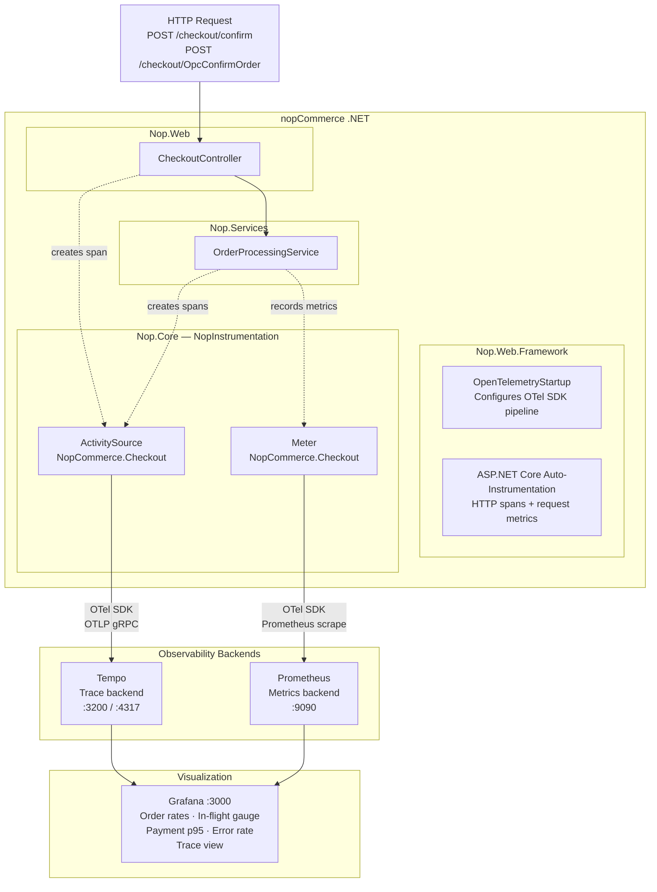
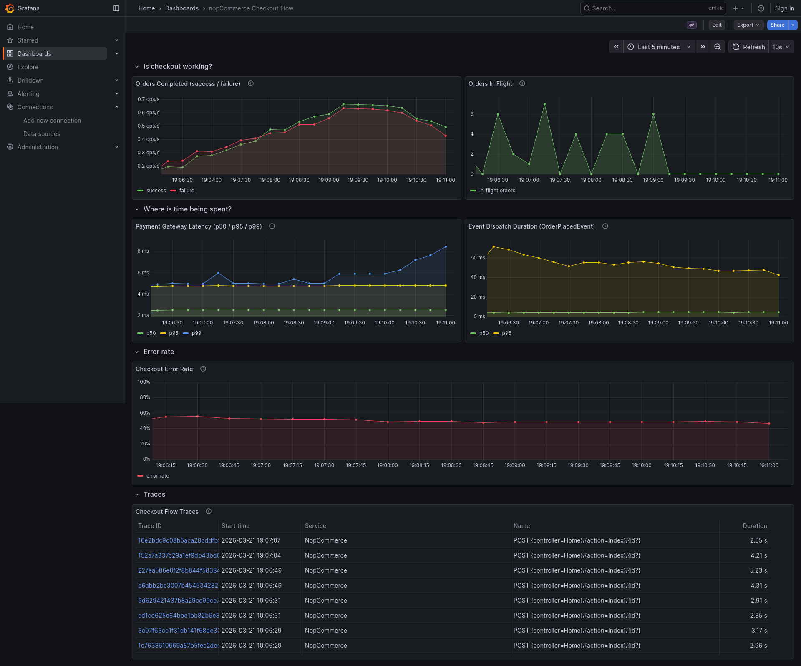
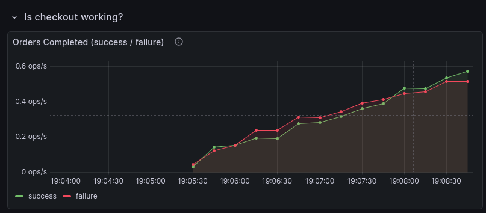
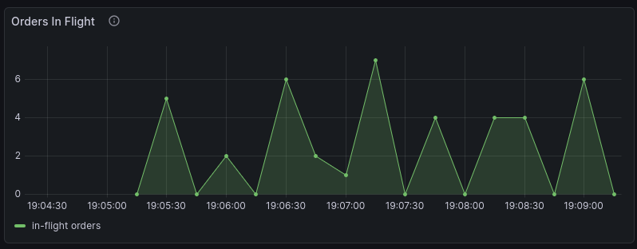
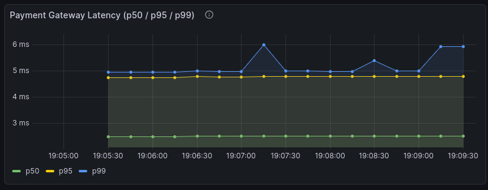
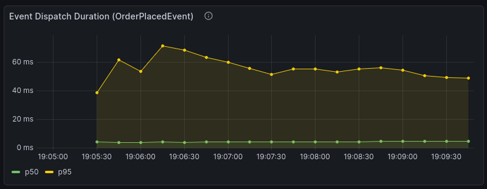
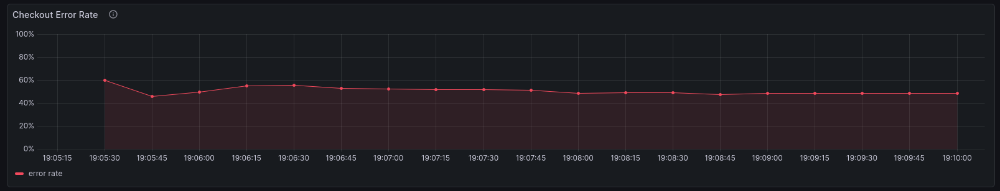
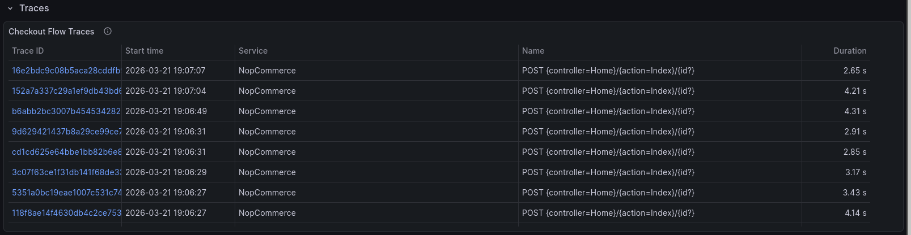

# nopCommerce - Order Placement Instrumentation

> Fork of [nopCommerce](https://github.com/nopSolutions/nopCommerce), a production-grade open-source ASP.NET Core e-commerce platform. This fork adds OpenTelemetry tracing, custom metrics, and a Grafana dashboard to the checkout flow as part of an observability assignment.

This fork adds OpenTelemetry tracing and metrics to the **order placement flow**. The instrumentation covers the full path from the HTTP entry point in `CheckoutController` through the service layer in `OrderProcessingService`.

### Instrumented Flow

```
CheckoutController                                    [Nop.Web]
  ConfirmOrder() / OpcConfirmOrder()                  ← span: checkout.confirm
  └─ OrderProcessingService.PlaceOrderAsync()         [Nop.Services]
       ├─ PreparePlaceOrderDetailsAsync()
       │    └─ PrepareAndValidateTotalsAsync()         ← span: order.validate_totals
       ├─ GetProcessPaymentResultAsync()               ← span: payment.process
       ├─ SaveOrderDetailsAsync()                      ← span: order.save
       ├─ MoveShoppingCartItemsToOrderItemsAsync()     ← span: inventory.adjust
       └─ Publish OrderPlacedEvent                     ← metric: event dispatch duration
```

### Instrumented Flow Architecture



### Custom Metrics

| Metric | Type | What it answers |
|--------|------|-----------------|
| Orders Completed | Counter (status=success/failure) | Are orders going through? |
| Orders In Flight | UpDownCounter | Is the system saturating? |
| Payment Gateway Latency | Histogram (ms) | Is the payment provider degrading? |
| Event Dispatch Duration | Histogram (ms) | Is a consumer slowing down checkout? |

### Prerequisites

- Docker and Docker Compose

### Build and Run

```bash
docker compose up --build
```

This starts all services:

| Service | URL |
|---------|-----|
| nopCommerce | http://localhost |
| Grafana | http://localhost:3000 (admin / admin) |
| Prometheus | http://localhost:9090 |
| Tempo | http://localhost:3200 |

On first launch, nopCommerce will show an installation page. Install with the sample data enabled and configure the database connection to `nopcommerce_mssql_server` with the password `nopCommerce_db_password`.

### View the Dashboard

Open Grafana at http://localhost:3000. The **nopCommerce Checkout Flow** dashboard is auto-provisioned and available under Dashboards. It includes:

- Orders Completed (success / failure rate)
- Orders In Flight (saturation gauge)
- Payment Gateway Latency (p50 / p95 / p99)
- Event Dispatch Duration (p50 / p95)
- Checkout Error Rate
- Checkout Flow Traces (via Tempo)

### Run the Load Test

The k6 service is excluded from `docker compose up` by default. Once all services are running and nopCommerce is fully loaded (verify by opening http://localhost in your browser), start the load test in a separate terminal:

```bash
docker compose --profile loadtest up k6
```

This runs a k6 script that simulates 50 concurrent users going through the full checkout flow for ~5 minutes. Metrics and traces will appear in Grafana within seconds.

### Dashboard Under Load



| Panel | Screenshot |
|-------|------------|
| Orders Completed (success / failure) |  |
| Orders In Flight (saturation) |  |
| Payment Gateway Latency |  |
| Event Dispatch Duration |  |
| Checkout Error Rate |  |
| Checkout Flow Traces |  |

### Additional Documentation

Detailed analysis and documentation are available in the `docs/` directory:

- [`docs/ARCHITECTURE.md`](docs/ARCHITECTURE.md) — Architecture analysis: layer organization, dependency rules, IEventPublisher, observability gaps
- [`docs/INSTRUMENTATION.md`](docs/INSTRUMENTATION.md) — Instrumentation plan: span hierarchy, metric justifications, sensitive data exclusion
- [`CRITIQUE.md`](CRITIQUE.md) — Architectural critique: what helped/hindered instrumentation, proposed changes, surgical modifications

### Repository Structure (Instrumentation Files)

```
├── CRITIQUE.md                              # Architectural critique
├── docker-compose.yml                       # Full observability stack
├── prometheus.yml                           # Prometheus scrape config
├── tempo.yml                                # Tempo trace backend config
├── Dockerfile                               # Multi-stage build
├── docs/
│   ├── ARCHITECTURE.md                      # Architecture analysis
│   ├── INSTRUMENTATION.md                   # Instrumentation plan & metric justifications
│   ├── nopCommerceArchitecture.png          # Architecture diagram
│   └── screenshots/                         # Dashboard & metric screenshots
├── grafana/
│   ├── dashboards/
│   │   └── checkout-flow.json               # Exported Grafana dashboard
│   └── provisioning/
│       ├── dashboards/dashboards.yml        # Dashboard auto-provisioning
│       └── datasources/datasources.yml      # Prometheus + Tempo datasources
├── loadtest/
│   └── checkout-flow.js                     # k6 load test script
└── src/
    ├── Libraries/Nop.Core/Infrastructure/Instrumentation/
    │   └── NopInstrumentation.cs            # ActivitySource + Meter definitions
    ├── Libraries/Nop.Services/Orders/
    │   └── OrderProcessingService.cs        # Spans + metrics (modified)
    ├── Presentation/Nop.Web/Controllers/
    │   └── CheckoutController.cs            # Entry-point span (modified)
    └── Presentation/Nop.Web.Framework/Infrastructure/
        └── OpenTelemetryStartup.cs          # OpenTelemetry SDK configuration
```


> The original nopCommerce README is preserved in [`ORIGINAL_README.md`](ORIGINAL_README.md).
